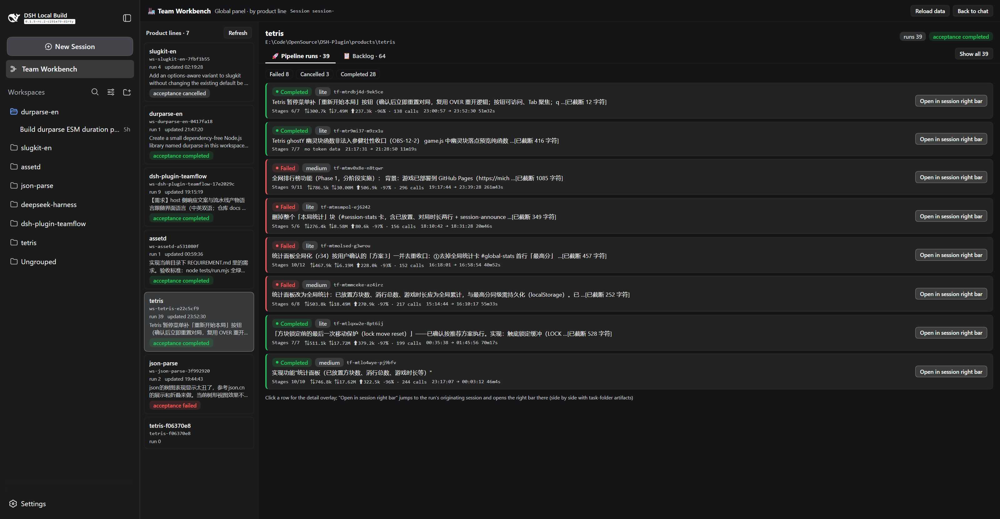
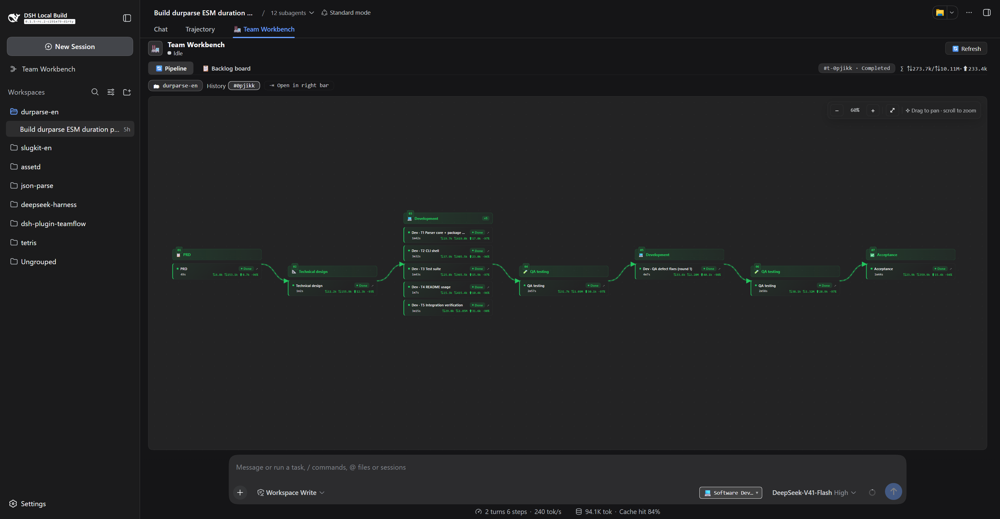
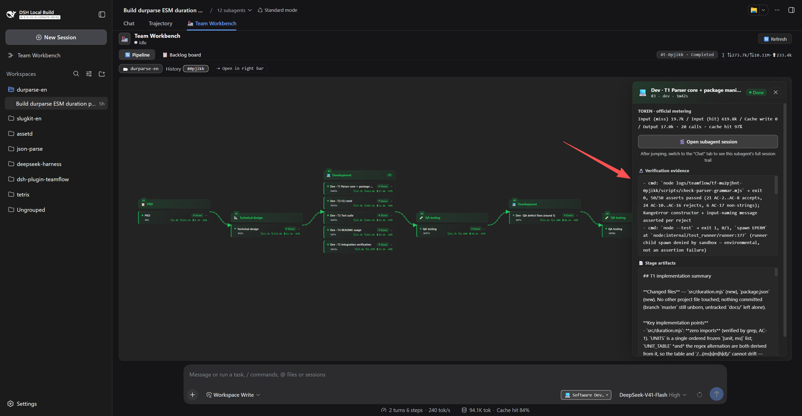
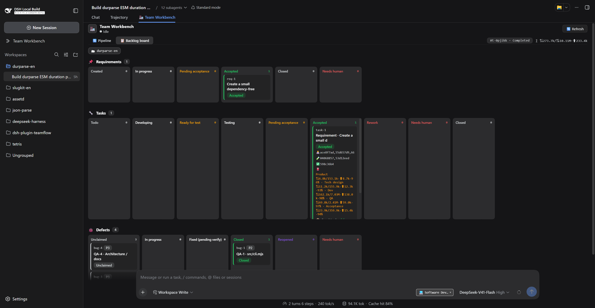
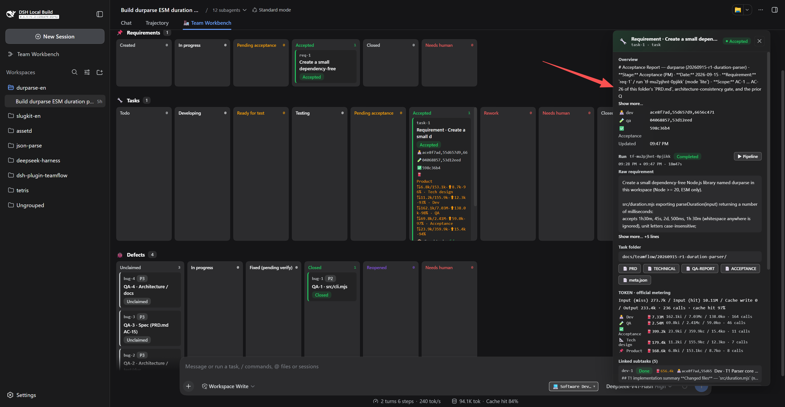
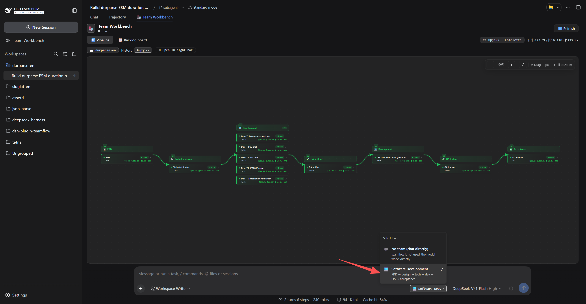

# dsh-plugin-teamflow

[](https://www.npmjs.com/package/dsh-plugin-teamflow) [](./LICENSE)

[中文](./README.md) | English

TeamFlow team R&D pipeline — a distributable DeepSeek Harness plugin (install via `dsh plugin --profile web add`).

Turns "one-line user requirement → real R&D team multi-agent pipeline" into a host-level capability:

```
requirement → PRD (based on existing patterns / product memory, archived to prevent bloat)
            → (UI redesign) UI/UX design
            → (new project) architect plans and scaffolds + AGENTS.md
            → senior full-stack engineer tech spec (aligned with dispatched tasks)
            → parallel dev when tasks are splittable
            → QA functional testing (structured defects → register bugs)
            → product acceptance (update product memory)
```

## Screenshots

1. Global panel — the 🏭 Team Workspace icon in the left sidebar (cross-session, product-line view: product list + run list + Backlog tab + overlay detail pane)

   

2. Pipeline view — stage serpentine lanes + node cards (status / duration / tokens / subagent session)

   

3. Stage detail drawer — full stage artifacts + token breakdown + "🎬 jump to subagent session"

   

4. Backlog board — draggable lanes for requirements / tasks / defects

   

5. Board task detail — task-card drawer (requirement text / assignments / event timeline / subtasks / defects / tokens)

   

6. Team selector — 🏭 button + team dropdown

   

## Core Features

- **One-line requirement → accepted delivery**: requirement → PRD → technical design → parallel development → QA → acceptance is orchestrated end to end; every stage gets a task card, artifacts and a verdict. Small mechanical changes can use the `patch` / `lite` tiers to trim the stage set instead of running a full waterfall.
- **Multi-agent team + parallel development**: the requirement is split into parallelizable tasks from the architecture blueprint (3 concurrent by default, 8 max), with product / architecture / dev / QA each working in their own isolated context.
- **Anti-fake-delivery**: delivery is judged by evidence, not wording — a stage must provide a `[Verification evidence]` block (command + exit code + assertion count), QA runs its own adversarial probes, and acceptance only trusts an explicit verdict line (missing ⇒ the pipeline stops for a human).
- **QA bounce-back loop**: P0–P2 defects are sent back for a fix and re-verified (≤2 rounds), each defect carrying its own check command and pass criterion; exceeding the limit hands over to a human instead of pretending the run is "done".
- **Resume + completion report**: after a crash or restart the pipeline continues from the first unfinished stage (completed stages reuse their artifacts); when a run ends, a summary (status / stages / tokens / next steps) is delivered back to the originating session.
- **Your repository stays clean**: pipeline docs live in the `docs/teamflow/` task folder and the plugin's own run logs are archived out of your project when the run ends — the closing commit carries **code + the task folder only** (one commit per run, **no pre-configured `.gitignore` required**). If an older commit already swept in `logs/teamflow/`, untrack it in that repository with `git rm -r --cached logs/teamflow` (your local files stay).
- **🏭 Team workbench (two entry points)**: an in-session tab (pipeline graph, drag-and-drop kanban, cost centre, human-intervention centre) and an app-level panel (product-line view, usable across sessions); open any run to see its stages, tokens, verification evidence and artifacts. The UI is **bilingual (Chinese / English)** and follows the host language live; host replies, pipeline logs and pipeline artifacts follow it too (resolved once per run).
- **Token accounting you can audit**: every stage records its input (cache miss / hit), cache write, output and call count, plus the cache-hit rate, shown on the same basis in reports and in the workbench; mechanical stages automatically drop their reasoning effort and raise it again on retry.


## AGENTS.md minimal-invasion principle (important)

AGENTS.md is unconditionally injected into every session by the harness; it is **team assets**. TeamFlow follows separation of concerns:

- **AGENTS.md holds only the stable consensus layer**: team role flows, engineering conventions, doc index, and the `<!-- teamflow:begin/end -->` managed region (pointers only).
- **Product memory / todos go in a separate live doc** `docs/teamflow/memory.md` (read on demand, not injected every session → saves token).
- **Onboarding existing projects**: if AGENTS.md already exists → never rewrite / reorder / overwrite; only append a managed block at the end (if none); the team's original conventions are left untouched line by line.
- **Clean exit**: after a team stops using TeamFlow, deleting the managed block and `docs/teamflow/` fully restores it, with no ledger left in AGENTS.md.

## Architecture (stage 3)

```
web profile host composition
├── teamflow-host   (host/)     Cordis service `teamflow`
│     ├── ctx.typert.register(strict descriptors)   ← Remote methods (`descriptors.ts` pure data, shared by host / client)
│     ├── ctx.tools.register(teamflow_*)            ← model tools
│     └── node:fs → $DSH_HOME/teamflow/…            ← backlog / journal / archived logs
└── teamflow-client (client/)   ← `package.json` declares `dsh.client`; the host composition scans and registers it
      ├── conversation.view "🏭 Team Workspace" (in-session tab)
      ├── sidebar.panellist + main/teamflow (global product-line panel)
      └── sidebarRightTabs "teamflow-run" (right-sidebar run detail)
```

Two hard constraints shaped this (details in `AGENTS.md` §3): **no `@Remote` decorator** (plugins ship as plain JS, so Remote uses `ctx.typert.register`'s strict descriptors); **it must be a host-level plugin** (a dynamic plugin's `fs` is sandboxed to the runtime root and cannot write `$DSH_HOME`).


## Directory structure

```
dsh-plugin-teamflow/
  package.json          # dsh.bundle.patch + dsh.client declarations; exports point to lib/
  cordis.patch.yml      # plugin mount patch (insert block, entry uses the package root)
  tsdown*.config.ts     # builds: client → lib/client.js; host/store/descriptors → lib/*.mjs
  host/                 # TeamflowService + core/* (pipeline / backlog / runner / guard / triage / state…)
  client/               # Web workbench (in-session tab + global panel + right-sidebar run detail)
  store.ts              # persistence layer (atomic write / backup / corruption self-heal + journal serialize)
  descriptors.ts        # Remote descriptors (pure data, shared by host / client)
  test/                 # dependency-free tests (node test/*.js, 14 suites)
  docs/                 # ADRs / dev log / benchmark corpus / release notes
```

The whole repo is TS/TSX: **the host must be built** (Node's type stripping does not apply to files under `node_modules`, and the host loads plugins from the profile's `node_modules`), so run `pnpm bundle` after changing source and sync the profile copy's `lib/`. Per-file details and the dev environment are in `CONTRIBUTING.md`.


## Requirements

- DeepSeek Harness (dsh) host, **web profile** (the plugin ships a browser-side workspace; the client targets the web platform);
- Node.js ≥ 22.18;
- Relies on host-provided `@deepseek-ai/dsh-*` and `react` (peerDependencies, injected by the host — no separate install needed).

### Version anchor (dsh host compatibility)

This plugin is developed and verified against **dsh v0.1.5-rc.2**; `package.json` declares the compatibility window **`engines.dsh: ">=0.1.5-rc.2 <0.2.0"`** plus `dsh.manifestVersion: 1` (dsh does not read or validate either field today — declarative author metadata). When installing dsh, go by **`next`**: `latest` lags behind it, so don't use `latest` to judge the release line.

If behaviour looks wrong after a dsh upgrade, check two things first: ① the session events this plugin injects (`tool-workflow/agent-start`, `user/message` with `source.kind='plugin'`) must sit inside the host's event vocabulary — **new custom event types must carry `ignorable: true`**, and known types must not add keys outside it; ② metering reads the host **projection keys** (`tokenUsage` / `sessionStats`), so if the host renames them or bumps their state version, `host/core/metering.ts` has to be updated in step. Compatibility checks and open follow-ups are recorded in `CHANGELOG.md` (0.1.6–0.1.9) and `docs/TODO.md` (for example, repeat detection still reads the deprecated event readers).


## Install (for users)

```bash
# Install from npm (after publish)
dsh plugin --profile web add dsh-plugin-teamflow

# Or local directory install (during development)
dsh plugin --profile web add file:./plugins/dsh-plugin-teamflow
```

After install, **restart** `dsh --profile web` for the host `teamflow-host` to take effect:
- The model side gains 12 `teamflow_*` tools: `start / triage / status / backlog / claim / update / assign / cancel / resume / pause / resume_session / merge`;
- The browser session header shows the "🏭 Team Workspace" tab (in-session) **and the "Team Workspace" icon in the left sidebar** (the global panel: product-line view, cross-session);
- Backlog is written to `$DSH_HOME/teamflow/<product>/backlog/*.json`.

> Note: `@deepseek-ai/*` are host-private packages; running requires the DeepSeek Harness (dsh) host environment; this package is neither published standalone nor runnable alone.

## Quick start

1. **Pick a team**: click the 🏭 button next to the input box and choose a team (or "no team" = chat directly, no pipeline);
2. **Say the requirement**: just describe it — the model calls `teamflow_start` automatically (auto-triage: patch / lite / tech / medium / full); or force a mode, e.g. "run this in medium mode";
3. **Watch progress**: switch to the 🏭 Team Workspace tab in the session header — the pipeline graph live-refreshes (per-stage token / duration / sub-agent session), and the backlog kanban supports drag transitions and card detail drawers; for a **cross-session / global** view, click the "Team Workspace" icon in the left sidebar (product-line perspective: product lines → runs + backlog), and hit "⏹ Stop" to cancel a live run (two-step confirm);
4. **Get the result**: the pipeline reports back to the session automatically when done (status / stage stats / token / next steps); interrupted/failed runs can "↻ resume from checkpoint".

> Note: after `teamflow_start`, the **main thread should not modify code or run verifications itself** — implementation, QA, and reporting are done by pipeline sub-agents (avoid fighting the pipeline over the workspace).

## Uninstall (for users)

```bash
dsh plugin --profile web remove dsh-plugin-teamflow
```

After restarting `dsh --profile web`, the plugin is fully removed (the model-side `teamflow_*` tools and the 🏭 Team Workspace tab disappear).

Optional cleanup (NOT done automatically; run as needed):
- **Runtime data**: delete `$DSH_HOME/teamflow/` (backlog / run records — confirm you no longer need them first).
- **Project traces**: if a team used TeamFlow in a project, delete the `<!-- teamflow:begin/end -->` managed block in that project's `AGENTS.md` and the `docs/teamflow/` directory to fully restore it (the "clean exit" rule of the AGENTS.md minimal-invasion principle).

## Development & verification

```bash
pnpm test               # smoke (descriptors / structure / security) + journal (resume behavior)
pnpm run typecheck      # tsc --noEmit type check (needs the local dsh profile for @deepseek-ai/* types)
node --check lib/host.mjs lib/client.js lib/store.mjs lib/descriptors.mjs
pnpm run bundle         # build client (tsdown → lib/client.js, registered via __ModuleLoader__.load)
```

**For plugin developers** (the local dev loop of THIS plugin): see [`AGENTS.md`](./AGENTS.md) and [`docs/adr/`](./docs/adr) in the repo — deployment sync (`node deploy.mjs` → restart `dsh --profile web`), the "running web loads the host from the profile deployment copy, building source alone does not take effect" caveat, design decision records (ADR-0001~0009) and benchmarks (`docs/benchmarks/`). All repo source is TS/TSX and must be built first (`pnpm bundle`) to run (`strip-types` does not apply under `node_modules`).

Note: `lib/` is excluded by `.gitignore` but must ship with the package (`files` whitelist includes `lib/`; `exports["./client"]` points to `./lib/client.js`).

## Contract quick reference

| Tool / Remote | Purpose |
|---|---|
| `teamflow_start` / `teamflow.start(sessionId, requirement, options)` | Start the pipeline |
| `teamflow_status` / `teamflow.list()` + `teamflow.snapshot(runId)` | Query run progress (stage / status / token / log / needs-human?) |
| `teamflow_backlog` / `teamflow.backlog(product)` | View backlog (+ persistence path) |
| `teamflow_claim` | Claim a task or defect |
| `teamflow_update` / `teamflow.backlogUpdate(kind, id, to, product, reason)` | Manually transition state (handle needs-human) |
| `teamflow_cancel` / `teamflow.cancel(runId)` | Cancel a run (buttons in the workbench, the global panel's run row and run detail; two-step confirm; only effective while the run is live) |
| `teamflow_resume` / `teamflow.resume(runId, sessionId)` | Resume from checkpoint (rerun from first unfinished stage) |
| `teamflow_triage` | Requirement triage preview (start auto-triages by default; use only to pre-assess / force a mode) |
| `teamflow_assign` | Assign owner of a task / defect (separate from claim: claim only changes state) |
| `teamflow_pause` / `teamflow_resume_session` | Pause / resume teamflow triggering for the current session (session-level, auto-reset on new session) |

## License

MIT — see [LICENSE](./LICENSE).
