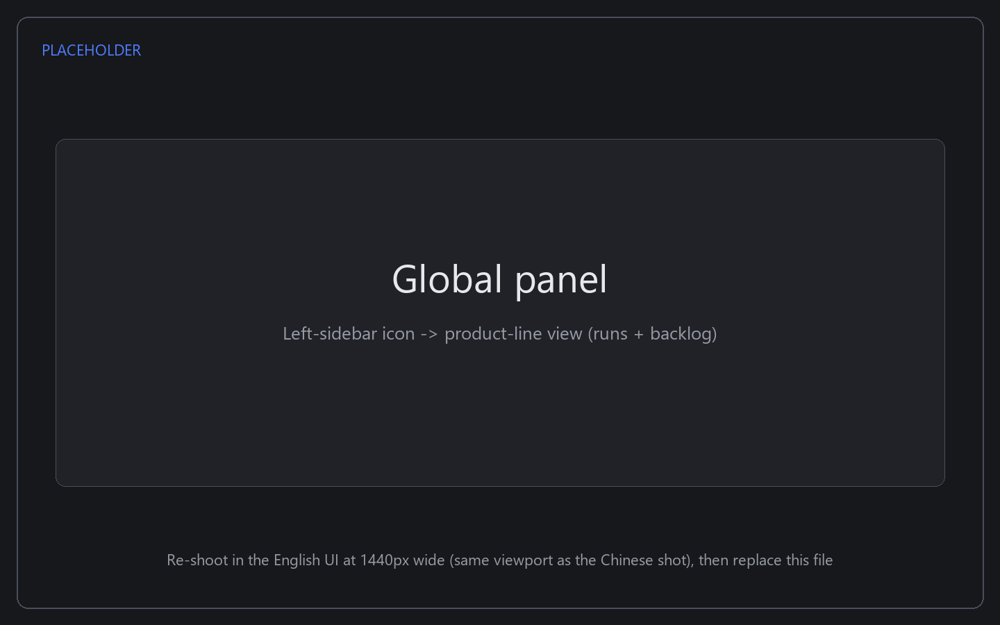
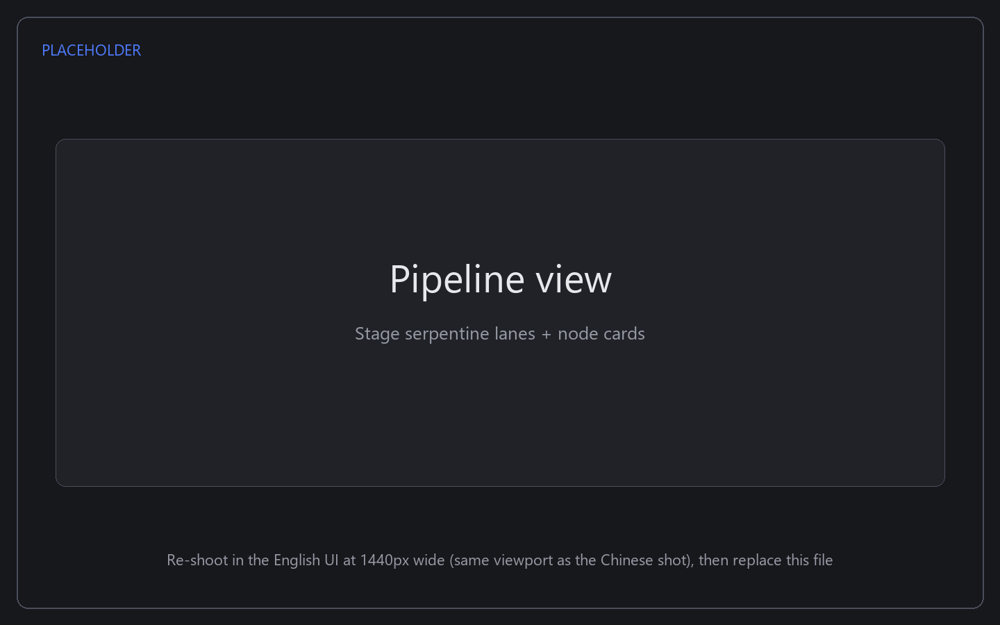
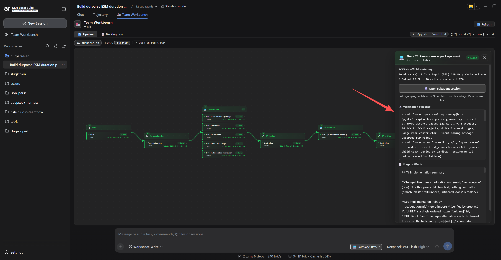
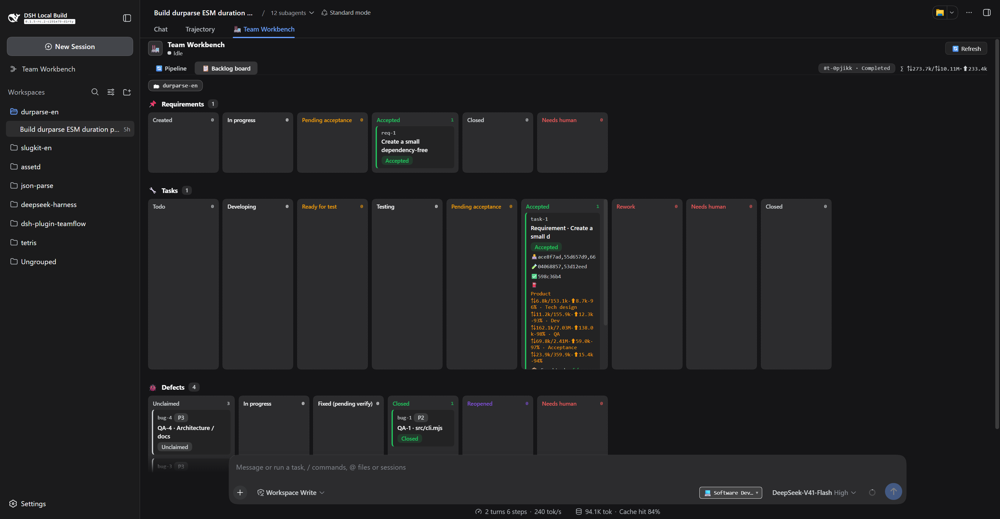
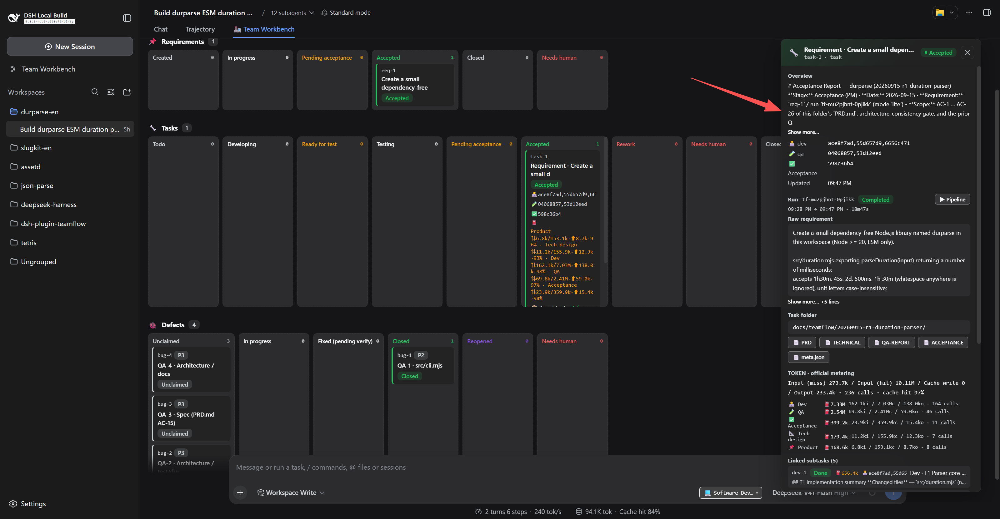
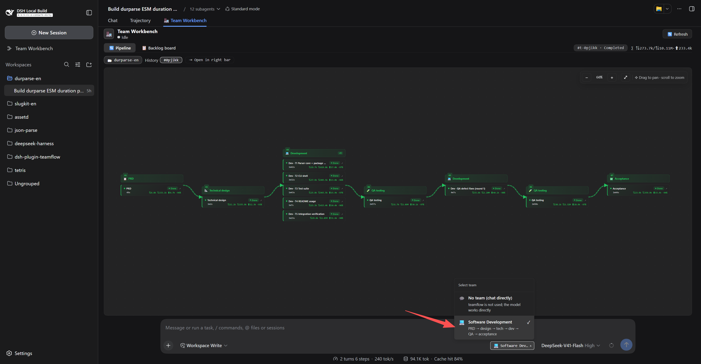

# dsh-plugin-teamflow

[](https://www.npmjs.com/package/dsh-plugin-teamflow) [](./LICENSE)

[中文](./README.md) | English

TeamFlow team R&D pipeline — a distributable DeepSeek Harness plugin (install via `dsh plugin --profile web add`).

Turns "one-line user requirement → real R&D team multi-agent pipeline" into a host-level capability:

```
requirement → PRD (based on existing patterns / product memory, archived to prevent bloat)
            → (UI redesign) UI/UX design
            → (new project) architect plans and scaffolds + AGENTS.md
            → senior full-stack engineer tech spec (aligned with dispatched tasks)
            → parallel dev when tasks are splittable
            → QA functional testing (structured defects → register bugs)
            → product acceptance (update product memory)
```

## Screenshots

1. Global panel — the 🏭 Team Workspace icon in the left sidebar (cross-session, product-line view: product list + run list + Backlog tab + overlay detail pane)

   

2. Pipeline view — stage serpentine lanes + node cards (status / duration / tokens / subagent session)

   

3. Stage detail drawer — full stage artifacts + token breakdown + "🎬 jump to subagent session"

   

4. Backlog board — draggable lanes for requirements / tasks / defects

   

5. Board task detail — task-card drawer (requirement text / assignments / event timeline / subtasks / defects / tokens)

   

6. Team selector — 🏭 button + team dropdown

   

## Core Features

- **One-line requirement → accepted delivery**: requirement → PRD → technical design → parallel development → QA → acceptance is orchestrated end to end; every stage gets a task card, artifacts and a verdict. Small mechanical changes can use the `patch` / `lite` tiers to trim the stage set instead of running a full waterfall.
- **Multi-agent team + parallel development**: the requirement is split into parallelizable tasks from the architecture blueprint (3 concurrent by default, 8 max), with product / architecture / dev / QA each working in their own isolated context.
- **Anti-fake-delivery**: delivery is judged by evidence, not wording — a stage must provide a `[Verification evidence]` block (command + exit code + assertion count), QA runs its own adversarial probes, and acceptance only trusts an explicit verdict line (missing ⇒ the pipeline stops for a human).
- **QA bounce-back loop**: P0–P2 defects are sent back for a fix and re-verified (≤2 rounds), each defect carrying its own check command and pass criterion; exceeding the limit hands over to a human instead of pretending the run is "done".
- **Resume + completion report**: after a crash or restart the pipeline continues from the first unfinished stage (completed stages reuse their artifacts); when a run ends, a summary (status / stages / tokens / next steps) is delivered back to the originating session.
- **Your repository stays clean**: pipeline docs live in the `docs/teamflow/` task folder and the plugin's own run logs are archived out of your project when the run ends — the closing commit carries **code + the task folder only** (one commit per run, **no pre-configured `.gitignore` required**). If an older commit already swept in `logs/teamflow/`, untrack it in that repository with `git rm -r --cached logs/teamflow` (your local files stay).
- **🏭 Team workbench (two entry points)**: an in-session tab (pipeline graph, drag-and-drop kanban, cost centre, human-intervention centre) and an app-level panel (product-line view, usable across sessions); open any run to see its stages, tokens, verification evidence and artifacts. The UI is **bilingual (Chinese / English)** and follows the host language live; host replies, pipeline logs and pipeline artifacts follow it too (resolved once per run).
- **Token accounting you can audit**: every stage records its input (cache miss / hit), cache write, output and call count, plus the cache-hit rate, shown on the same basis in reports and in the workbench; mechanical stages automatically drop their reasoning effort and raise it again on retry.


## AGENTS.md minimal-invasion principle (important)

AGENTS.md is unconditionally injected into every session by the harness; it is **team assets**. TeamFlow follows separation of concerns:

- **AGENTS.md holds only the stable consensus layer**: team role flows, engineering conventions, doc index, and the `<!-- teamflow:begin/end -->` managed region (pointers only).
- **Product memory / todos go in a separate live doc** `docs/teamflow/memory.md` (read on demand, not injected every session → saves token).
- **Onboarding existing projects**: if AGENTS.md already exists → never rewrite / reorder / overwrite; only append a managed block at the end (if none); the team's original conventions are left untouched line by line.
- **Clean exit**: after a team stops using TeamFlow, deleting the managed block and `docs/teamflow/` fully restores it, with no ledger left in AGENTS.md.

## Architecture (stage 3)

```
web profile host composition
├── teamflow-host   (host/)     Cordis service `teamflow`
│     ├── ctx.typert.register(strict descriptors)   ← Remote methods (`descriptors.ts` pure data, shared by host / client)
│     ├── ctx.tools.register(teamflow_*)            ← model tools
│     └── node:fs → $DSH_HOME/teamflow/…            ← backlog / journal / archived logs
└── teamflow-client (client/)   ← `package.json` declares `dsh.client`; the host composition scans and registers it
      ├── conversation.view "🏭 Team Workspace" (in-session tab)
      ├── sidebar.panellist + main/teamflow (global product-line panel)
      └── sidebarRightTabs "teamflow-run" (right-sidebar run detail)
```

Two hard constraints shaped this (details in `AGENTS.md` §3): **no `@Remote` decorator** (plugins ship as plain JS, so Remote uses `ctx.typert.register`'s strict descriptors); **it must be a host-level plugin** (a dynamic plugin's `fs` is sandboxed to the runtime root and cannot write `$DSH_HOME`).


## Directory structure

```
dsh-plugin-teamflow/
  package.json          # dsh.bundle.patch + dsh.client declarations; exports point to lib/
  cordis.patch.yml      # plugin mount patch (insert block, entry uses the package root)
  tsdown*.config.ts     # builds: client → lib/client.js; host/store/descriptors → lib/*.mjs
  host/                 # TeamflowService + core/* (pipeline / backlog / runner / guard / triage / state…)
  client/               # Web workbench (in-session tab + global panel + right-sidebar run detail)
  store.ts              # persistence layer (atomic write / backup / corruption self-heal + journal serialize)
  descriptors.ts        # Remote descriptors (pure data, shared by host / client)
  test/                 # dependency-free tests (node test/*.js, 14 suites)
  docs/                 # ADRs / dev log / benchmark corpus / release notes
```

The whole repo is TS/TSX: **the host must be built** (Node's type stripping does not apply to files under `node_modules`, and the host loads plugins from the profile's `node_modules`), so run `pnpm bundle` after changing source and sync the profile copy's `lib/`. Per-file details and the dev environment are in `CONTRIBUTING.md`.


## Requirements

- DeepSeek Harness (dsh) host, **web profile** (the plugin ships a browser-side workspace; the client targets the web platform);
- Node.js ≥ 22.18;
- Relies on host-provided `@deepseek-ai/dsh-*` and `react` (peerDependencies, injected by the host — no separate install needed).

### Version anchor (dsh host compatibility)

This plugin is developed and verified against **dsh v0.2.0-rc.2** (preview). **The floor is still v0.1.7-alpha.1**: every message the plugin injects must carry a producer-owned `source.kind` (`plugin:dsh-plugin-teamflow`), while a v3 host validates `source.kind` against a **closed vocabulary** (`SOURCE_KINDS` contains no `plugin:*`) — the old form `{kind:'plugin', plugin:…}` is rejected outright by a v4 host, and the new form is equally illegal on a v3 host, so the two shapes are **mutually incompatible**; the plugin therefore no longer claims it can run back to v0.1.5-rc.2. The Remote descriptors still expose both `schema` and `create()` for hosts of either generation, see "typert descriptor contract" below. `package.json`'s `engines.dsh` and `dsh.manifestVersion: 1` are declarative author metadata — the host **neither reads nor validates** them (measured; see below).

⚠️ **The upper bound of `engines.dsh` cannot simply be widened** (measured 2026-10-02 with semver 7.7.4's `satisfies`): under the rule that *a prerelease only matches a range carrying a prerelease on the same `[major,minor,patch]` tuple*, changing `<0.2.0` to `<0.3.0` still evaluates to **fail for `0.2.0-rc.1` / `0.2.0-rc.2`**. The declared range is therefore a **union**: `">=0.1.7-alpha.1 <0.3.0 || >=0.2.0-rc.1 <0.3.0"`.

| Range | 0.1.6-a.2 | 0.1.7-a.1 | 0.1.7 | 0.1.9 | 0.2.0-rc.1 | 0.2.0-rc.2 | 0.2.0 |
| --- | --- | --- | --- | --- | --- | --- | --- |
| `>=0.1.7-alpha.1 <0.2.0` (previous) | fail | PASS | PASS | PASS | fail | fail | fail |
| `>=0.1.7-alpha.1 <0.3.0` (**not enough**) | fail | PASS | PASS | PASS | **fail** | **fail** | PASS |
| `>=0.2.0-rc.1 <0.3.0` (drops the 0.1.7 line) | fail | fail | fail | fail | PASS | PASS | PASS |
| **union (current declaration)** | fail | PASS | PASS | PASS | PASS | PASS | PASS |

`0.1.6-alpha.2` still fails, matching the v4 floor above. A field like this only states compatibility **against stable releases**; the host does not validate it anyway, and day to day you should go by **`next`**: `latest` lags behind it, so don't use `latest` to judge the release line.

**Breaking surface of v0.1.7-alpha.1 (this audit)**: the session event format moved to **v4** — before adopting an event the host validates every message's `source.kind` and **refuses the retired v3 plugin wrapper** (`{kind:'plugin', plugin:…}` → `format v4 message requires a producer-owned source kind`), requiring `kind:'plugin:<name>'` instead. All four injection sites (team context ×2 / completion report / guard reminder) still wrote the old wrapper, so a fresh run failed at the write step (the journal never even landed). They now emit `plugin:dsh-plugin-teamflow`. Every other surface re-checked (typert strict descriptors still require `create()`, `subagents.start`/`SubagentRun`, the `tokenUsage` four buckets + `sessionStats.steps`, `agent.inject/followup/steer`, the `settings.locale` read-only port, `remote.$mount`, `sessions.openSubagent`, `sidebarRight.openResource`) showed **no breakage**.

**Breaking surface of v0.2.0-rc.2 (audited 2026-10-02)**: **none found**, on seven pieces of evidence.

1. `tsc --noEmit` compiles **directly against the 0.2.0-rc.2 packages already installed in the profile** (`tsconfig.json` paths point at `~/.dsh/profiles/node_modules/@deepseek-ai/*`, which is already 0.2.0-rc.2) and reports **0 errors**; and only **14 of 12036** host lines use `: any` (0.1%, plus 2 `as any`) ⇒ the passing typecheck is not an `any` illusion (`strict: false` affects null-safety, **not** property-existence checks).
2. The plugin imports from only **4 `@deepseek-ai/*` packages, one symbol each**; all were checked against 0.2.0-rc.2's runtime exports ⇒ **0 missing**.
3. `dsh.client.inject` semantics are unchanged (still "package rows whose factories must arrive before this row materializes"). ⚠ The manifest type's comment calling `inject` "Informational … **not** Cordis service injection" speaks **for Cordis** (the real service edges come from patch rows); the runtime still uses the manifest's `inject` for factory arrival order — **don't read that comment as a semantic change**.
4. The manifest schema is compatible: `manifestVersion: 1` is still valid, `bundle.patch` is still `string | string[]`, and `client.platform / inject / immediately` are all present. The **new `external` field is optional** and carries "non-inject module requests (exact specifiers, subpaths allowed)" ⇒ **this plugin needs nothing there**.
5. `insert:` rows in `cordis.patch.yml` are still supported (0.2.0's new capability *adds* "a bundle lists its own rows"; it does not replace the old mechanism).
6. The host only validates **`peerDependencies`** entries named `@deepseek-ai/dsh*` (all of ours are `*` ⇒ pass) and **does not read `engines.dsh`** ⇒ the range above is a declaration only.
7. dsh ships no `CHANGELOG`; `docs/upgrade-guide/` still only has the v0.1.7-rc.2 guide — **the 0.2.0 upgrade guide is not written yet** (this section stands in for it).

⚠️ **Boundary of this audit**: everything above is **static**. Runtime behaviour (whether cordis services are still there when the plugin activates, whether the plugin loads in the desktop profile) **needs a host restart to verify** — a passing `tsc` is not proof of running on 0.2.0.

**Behavioural changes that may help / need re-checking (not breaking)**: 0.2.0 ships nine `fix(windows)` commits plus an ACL diagnosis skill (worth re-testing the "fresh directory on E: fails grantWrite with Win32 5" issue); `user-questions` gained timed waits and late replies (our clarification gate needs its call contract re-checked); `schedule` became an optional bundle.

**Breaking surface of v0.1.6-alpha.2 (previous audit)**: the typert strict codec changed from `{ mode, typeSymbol, schema }` to `{ mode, typeSymbol, create: () => Schema }` (lazy materialisation — `materializeSchema` does `record.value ??= record.create()`); `validateCodec` **throws at registration** for a strict codec missing `create()` — `"strict codec has no create() factory"`. Combined with dsh-app-boot's policy (a required plugin failing to activate fails the whole profile with `startup failed`), the symptom is **"dsh won't start"** (`web boot: N entries did not activate`). A full diff of the other surfaces (client-modules / subagent / agent runtime / manifest / the tools llm projection) found no further breakage for this plugin, and the three UI slot packages have zero changes in `src/index.ts` → slot names are safe.

If behaviour looks wrong after a dsh upgrade, check two things first: ① the session events this plugin injects (`tool-workflow/agent-start`, `user/message` with `source.kind='plugin:dsh-plugin-teamflow'`) must sit inside the host's event vocabulary — **a v4 host only accepts producer-owned source kinds (the v3 `plugin` wrapper is retired)**, and a v3 host's closed vocabulary does not accept `plugin:*` either (hence the v4 floor); `tool-workflow/agent-start` carries no message/source slot and is outside that check. **New custom event types must carry `ignorable: true`**, and known types must not add keys outside it; ② metering reads the host **projection keys** (`tokenUsage` / `sessionStats`), so if the host renames them or bumps their state version, `host/core/metering.ts` has to be updated in step. Compatibility checks and open follow-ups are recorded in `CHANGELOG.md` (0.1.6–0.1.9) and `docs/TODO.md` (for example, repeat detection still reads the deprecated event readers).


## Install (for users)

```bash
# Install from npm (after publish) — into the web profile
dsh plugin --profile web add dsh-plugin-teamflow

# Or local directory install (during development)
dsh plugin --profile web add file:./plugins/dsh-plugin-teamflow
```

> ⚠️ **The desktop app (dsh 0.2.0+) needs its own install.** It runs from a **separate `desktop`
> profile** (`~/.dsh/profiles/desktop`) with its own `node_modules`, separate from `web` — install
> it only into `web` and **the desktop app will not show the plugin** (nothing is broken; that
> profile simply doesn't have it). The CLI also **explicitly refuses** `--profile desktop`:
> `error: profile "desktop" is managed exclusively by the Electron application` ⇒ **install it from
> the desktop app's own plugin management UI**, do not try to name that profile on the command line.
>
> The Electron app owns that profile, but it only writes `package.json` **when the file is missing**
> (`packages/boot/app-boot/src/profile.ts`), so a hand-written plugin declaration is not wiped at startup.

After install, **restart** `dsh --profile web` (or restart the desktop app) for the host `teamflow-host` to take effect:
- The model side gains 12 `teamflow_*` tools: `start / triage / status / backlog / claim / update / assign / cancel / resume / pause / resume_session / merge`;
- The browser session header shows the "🏭 Team Workspace" tab (in-session) **and the "Team Workspace" icon in the left sidebar** (the global panel: product-line view, cross-session);
- Backlog is written to `$DSH_HOME/teamflow/<product>/backlog/*.json`.

> Note: `@deepseek-ai/*` are host-private packages; running requires the DeepSeek Harness (dsh) host environment; this package is neither published standalone nor runnable alone.

## Quick start

1. **Pick a team**: click the 🏭 button next to the input box and choose a team (or "no team" = chat directly, no pipeline);
2. **Say the requirement**: just describe it — the model calls `teamflow_start` automatically (auto-triage: patch / lite / tech / medium / full); or force a mode, e.g. "run this in medium mode";
3. **Watch progress**: switch to the 🏭 Team Workspace tab in the session header — the pipeline graph live-refreshes (per-stage token / duration / sub-agent session), and the backlog kanban supports drag transitions and card detail drawers; for a **cross-session / global** view, click the "Team Workspace" icon in the left sidebar (product-line perspective: product lines → runs + backlog), and hit "⏹ Stop" to cancel a live run (two-step confirm);
4. **Get the result**: the pipeline reports back to the session automatically when done (status / stage stats / token / next steps); interrupted/failed runs can "↻ resume from checkpoint".

> Note: after `teamflow_start`, the **main thread should not modify code or run verifications itself** — implementation, QA, and reporting are done by pipeline sub-agents (avoid fighting the pipeline over the workspace).

## Uninstall (for users)

```bash
dsh plugin --profile web remove dsh-plugin-teamflow
```

After restarting `dsh --profile web`, the plugin is fully removed (the model-side `teamflow_*` tools and the 🏭 Team Workspace tab disappear).

Optional cleanup (NOT done automatically; run as needed):
- **Runtime data**: delete `$DSH_HOME/teamflow/` (backlog / run records — confirm you no longer need them first).
- **Project traces**: if a team used TeamFlow in a project, delete the `<!-- teamflow:begin/end -->` managed block in that project's `AGENTS.md` and the `docs/teamflow/` directory to fully restore it (the "clean exit" rule of the AGENTS.md minimal-invasion principle).

## Development & verification

```bash
pnpm test               # smoke (descriptors / structure / security) + journal (resume behavior)
pnpm run typecheck      # tsc --noEmit type check (needs the local dsh profile for @deepseek-ai/* types)
node --check lib/host.mjs lib/client.js lib/store.mjs lib/descriptors.mjs
pnpm run bundle         # build client (tsdown → lib/client.js, registered via __ModuleLoader__.load)
```

**For plugin developers** (the local dev loop of THIS plugin): see [`AGENTS.md`](./AGENTS.md) and [`docs/adr/`](./docs/adr) in the repo — deployment sync (`node deploy.mjs` → restart `dsh --profile web`), the "running web loads the host from the profile deployment copy, building source alone does not take effect" caveat, design decision records (ADR-0001~0010) and benchmarks (`docs/benchmarks/`). All repo source is TS/TSX and must be built first (`pnpm bundle`) to run (`strip-types` does not apply under `node_modules`).

Note: `lib/` is excluded by `.gitignore` but must ship with the package (`files` whitelist includes `lib/`; `exports["./client"]` points to `./lib/client.js`).

## Contract quick reference

| Tool / Remote | Purpose |
|---|---|
| `teamflow_start` / `teamflow.start(sessionId, requirement, options)` | Start the pipeline |
| `teamflow_status` / `teamflow.list()` + `teamflow.snapshot(runId)` | Query run progress (stage / status / token / log / needs-human?) |
| `teamflow_backlog` / `teamflow.backlog(product)` | View backlog (+ persistence path) |
| `teamflow_claim` | Claim a task or defect |
| `teamflow_update` / `teamflow.backlogUpdate(kind, id, to, product, reason)` | Manually transition state (handle needs-human) |
| `teamflow_cancel` / `teamflow.cancel(runId)` | Cancel a run (buttons in the workbench, the global panel's run row and run detail; two-step confirm; only effective while the run is live) |
| `teamflow_resume` / `teamflow.resume(runId, sessionId)` | Resume from checkpoint (rerun from first unfinished stage) |
| `teamflow_triage` | Requirement triage preview (start auto-triages by default; use only to pre-assess / force a mode) |
| `teamflow_assign` | Assign owner of a task / defect (separate from claim: claim only changes state) |
| `teamflow_pause` / `teamflow_resume_session` | Pause / resume teamflow triggering for the current session (session-level, auto-reset on new session) |

## License

MIT — see [LICENSE](./LICENSE).
