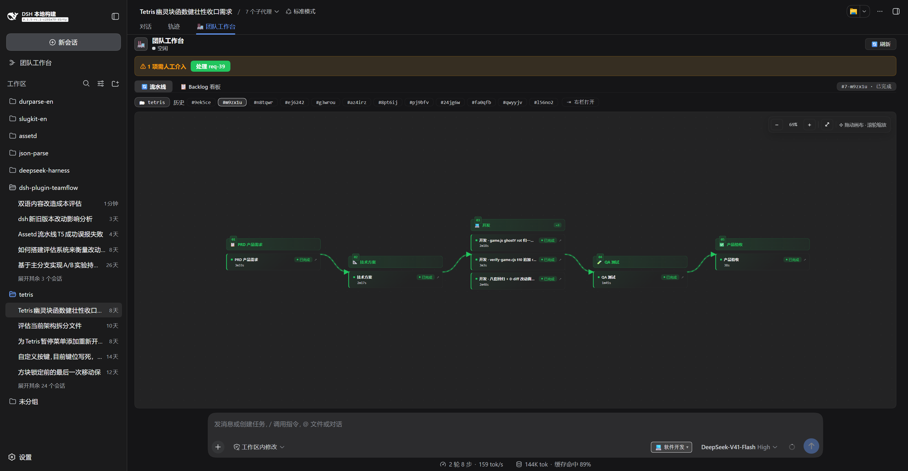
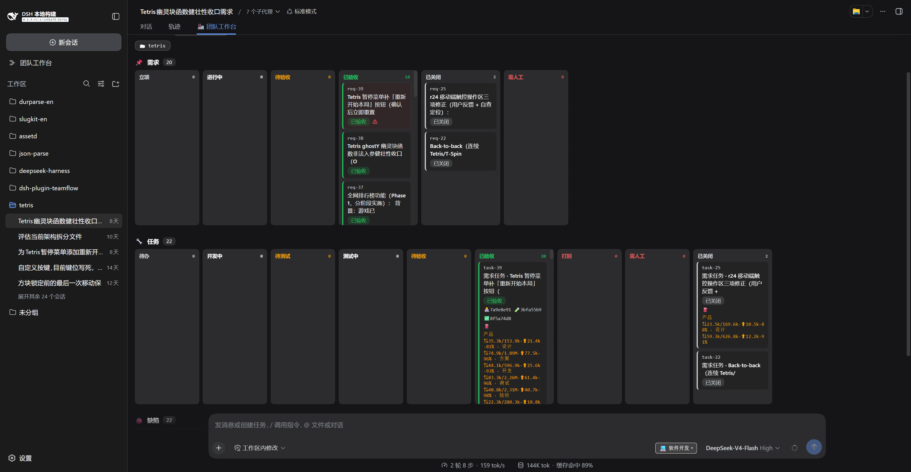
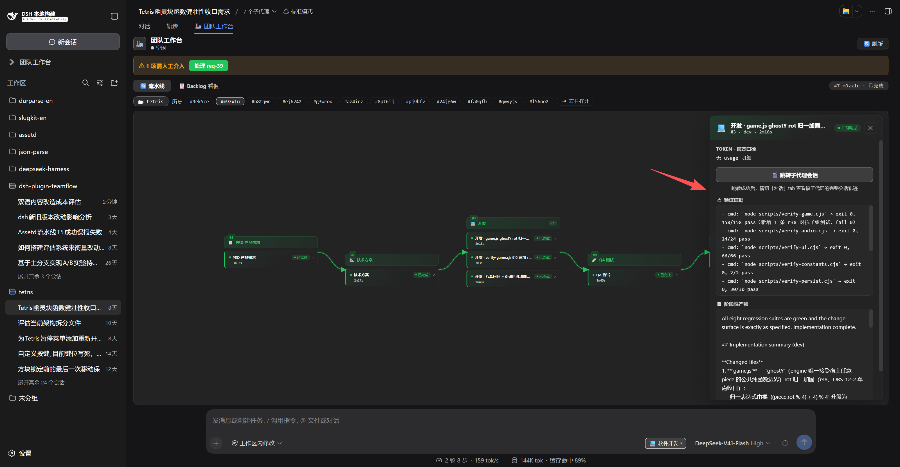
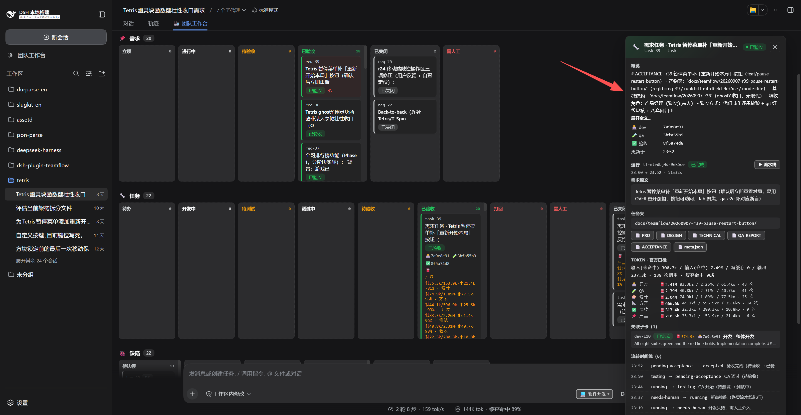
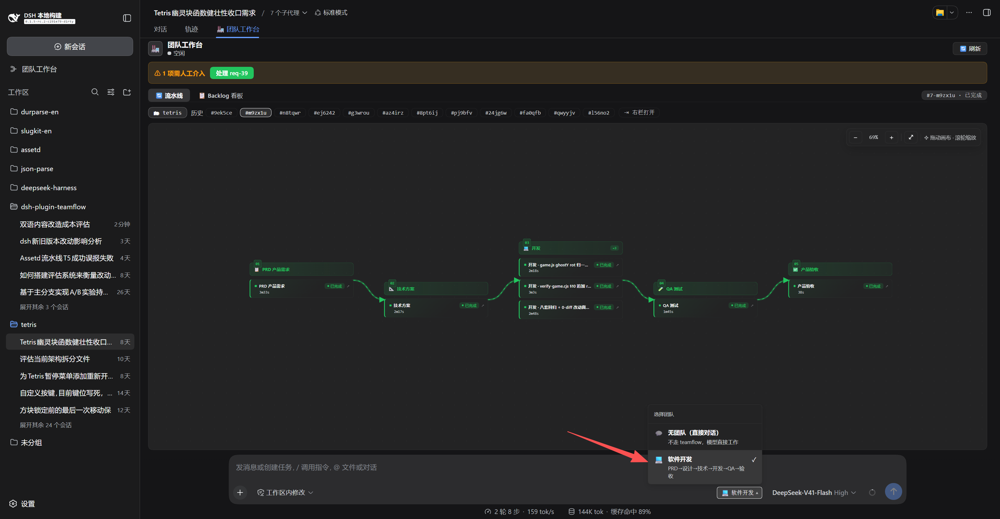

# dsh-plugin-teamflow

[](https://www.npmjs.com/package/dsh-plugin-teamflow) [](./LICENSE)

中文 | [English](./README.en.md)

TeamFlow 团队研发流水线 —— DeepSeek Harness 可分发插件（`dsh plugin --profile web add` 安装）。

把「用户一句话需求 → 真实研发团队多 Agent 流水线」做成宿主级能力：

```
需求 → PRD（基于既有模式/产品记忆，文档归档防臃肿）
     → （UI 改造时）UI/UX 设计
     → （新项目时）架构师规划并落地脚手架 + AGENTS.md
     → 高级全栈工程师技术方案（与派发任务对齐）
     → 可拆分任务时按并发并行开发
     → QA 功能测试（结构化缺陷 → 登记 Bug）
     → 产品验收（更新产品记忆）
```

## 界面预览

1. 流水线视图——阶段蛇形泳道 + 节点卡片（状态/耗时/token/子代理会话）

   

2. Backlog 看板——需求/任务/缺陷拖拽泳道

   

3. 阶段详情抽屉——阶段性产物全文 + token 明细 +「🎬 跳转子代理会话」

   

4. 看板任务详情——任务卡抽屉（需求原文/分配/事件时间线/子卡/缺陷/token）

   

5. 团队选择——🏭 按钮 + 团队下拉

   

## 核心特性

- **防假交付**：① 交付判定按**信号分级**——客观形态（非空 + 阶段长度下限）→ 真交付信号（`[Verification evidence]` 证据块）→ **措辞兜底**（仅在**无证据块**时才把"我无法完成"等拒绝措辞视为未交付；命中措辞但已带证据块只记诊断、不否决——如实汇报环境限制不再被误杀）；② token 熔断——单次调用累计**新增**消耗（`input+cacheWrite+output`，不含缓存命中）超 200k 停止重试转人工；③ 上下文耗尽类失败不重试（重试同一 prompt 大概率复现）；④ 产品级并发锁——同一产品同时只允许一条活跃流水线，防需求状态互踩；⑤ 阶段产物全文保留（内存 + 磁盘，供详情抽屉与断点续跑读取）。
- **完成汇总自动汇报主线程**：流水线结束（成功/失败/取消/中断）后自动把汇总（状态/阶段统计/token 总计/backlog/后续操作指引）投递给发起会话的 Agent——空闲时唤醒（followup），忙碌时注入下一步上下文（inject），与 DSH 后台任务通知同款机制（tool-jobs 模式，但独立实现，不依赖 web 面被禁用的 tool-jobs）。用户无需盯面板，模型会转述结果或按指引继续（认领缺陷/流转/断点重跑）。
- **断点续跑**：每阶段 checkpoint 落盘 `$DSH_HOME/teamflow/runs/<runId>.json`（LangGraph checkpointer 语义）；进程崩溃/重启后自动标记 `interrupted`，可用 `teamflow_resume` / 面板「↻ 从断点重跑」从第一个未完成阶段继续（跳过已完成阶段，复用阶段产物全文）。
- **backlog 持久化（v0.1.0 起按工作区隔离）到 `$DSH_HOME/teamflow/<workspace>/backlog/`**
  `requirements.json` / `tasks.json` / `bugs.json`，跨重启不丢；backlog 按「工作区（项目）」隔离——一个工作区就是一条项目线，不同工作区各看各的团队工作台。
- **单任务模型**：一个需求 = 一张轮转任务卡（不再按角色拆任务），任务卡记录 `devAssign` / `qaAssign` / 验收人，状态轮转：待办→开发中→待测试→测试中→待验收→已验收|打回|需人工；交付前端页面同时展示每个角色花在该任务上的**真实 token usage**。
- **产物收口**：流水线文档（PRD/设计/架构/技术方案/QA/记忆/历史）全部收口到 `docs/teamflow/`，命令运行日志在 run 期间暂存到 `logs/teamflow/<runId>/`，宿主 `docs/<职责>/` 与项目根不再被 TeamFlow 污染。
- **日志根在 `$DSH_HOME`，不在你的项目里（v0.1.9）**：子代理受 DSH 文件沙箱约束（`workspace-write` 只能写会话工作区），所以只能先在项目内暂存；**run 一结束 host 就把其中值得留的东西归档到 `$DSH_HOME/teamflow/<workspace>/logs/<runId>/` 并删掉项目内副本**（host 自身的事件日志 `run.log` 直接落归档位）。**不制造输出 dump**：子代理被要求**不要**把命令/套件输出重定向进文件——长输出本来就由宿主截成 tail、全文 spill 到它报告的临时路径（这是 DSH 原生能力），所以要留存的只有**检查脚本**（`scripts/`）、**不可重跑的命令载荷**（`captures.json`）与结论笔记（`.md`），其余（`*.log`/`*.out`/`*.txt`/源码快照）**归档时一律丢弃**。实测一次真实 run 里 93% 是可重跑输出或 git 里已有的副本。崩溃/被 kill 的 run 不留残渣：下次同工作区起跑按同一标准处理残留（自愈），**每个工作区只保留最近 20 次 run**。
- **交付面与噪音隔离**：只有**代码 + `docs/teamflow/` 任务夹**进收口提交（一个 run 一个 commit）；`logs/teamflow/` 是插件自己的运行日志（含子代理的临时验证脚本），**不属于交付物**——host 提交前先把这条规则**幂等写进工作区 `.gitignore`**（随本次提交可见），整树 `git add` 之后再**把该目录从索引里摘掉**（`git rm -r --cached --ignore-unmatch`，只动索引、不删你的文件），因此**目标项目不需要预先配置 .gitignore**（这两道防线覆盖的是「run 进行中你自己提交」的窗口）。若你的仓库已经提交过这批日志，可在目标仓库执行 `git rm -r --cached logs/teamflow` 移出（本地文件保留）。
- **状态机 + 事件日志**：需求（立项→进行中→待验收→已验收）、任务（待办→开发中→待测试→测试中→待验收→完成|打回|需人工）、缺陷（待认领→处理中→已修复待验→已关闭）。
- **打回阈值**：单阶段连续 2 次 Agent 失败自动重试，仍失败 → `needs-human`，需人工介入。
- **并发池**：开发任务按 `maxConcurrency`（默认 3，最大 8）并行执行。
- **QA 缺陷登记**：QA 报告按固定表格输出 → 自动解析成 Bug 进入 backlog。
- **token 计量（官方口径）**：每阶段记录 `usage` = **输入(缓存未命中)/输入(缓存命中)/写缓存/输出 + 调用数**（由子代理会话逐事件累计）+ **缓存命中率**（cacheRead/(input+cacheRead)）。工作台卡片/任务卡/完成汇报均按此口径展示，模型无关、与官方账单一致。
- **lite 模式**：微功能轻量——`teamflow_start(lite:true)` 跳过独立技术方案文档阶段（PRD 即契约），直接 **PRD → 开发 → QA → 验收**；配套 `needDesign:true` 时**保留 UI/UX 设计阶段**。用「按需求规模裁剪阶段集」换流程重量，避免一个微功能套完整瀑布（`patch` 档更小：单点确认 + 开发）。
- **token 熔断**：单次调用累计**新增**消耗（`input+cacheWrite+output`，**不含缓存命中**）超 `FRESH_TOKEN_BUDGET`（默认 200k）时停止重试、需人工介入；汇报/展示仍按官方 billed 口径（`totalTokensOf`）。缓存命中是廉价重放，把它计入熔断会让「任何任务失败一次就熔断、自动重试形同虚设」——见 `docs/devlog.md` 补 15。
- **🏭 团队工作台（双入口）**：
  - **会话内 tab**：与 chat / 轨迹并列的会话头部 tab，含：
    - 流水线图形工作流（阶段泳道 + 节点卡片：状态/耗时/token/子代理会话，2s 实时刷新）
    - **Backlog 拖拽看板**（需求/任务/缺陷三组状态泳道，卡片拖拽流转，原生 HTML5 DnD 零依赖）
    - 成本中心（每阶段 token + 总计 + 运行时长）
    - 人工介入中心（needs-human 项聚合 + 一键终态）
    - 历史 run 切换 + 产品切换 + 「⇥ 右栏打开 run 详情」
  - **全局面板**（v0.1.8）：侧边栏图标 → 中央主区整块切换为**产品线视角**——左栏产品线列表（`$DSH_HOME/teamflow/<key>`，含 run 计数/活跃数/最近需求与结论），右栏该产品线的 run 列表 + backlog 分组（不依附会话，跨会话可用）。点 run 在**面板内联**看详情（阶段/尝试/验证证据/产出/日志）；要并排看产物就点 run 行的「对话右栏」= 切回对话并在右侧栏打开（**右侧栏的会话内容宿主只在对话视图渲染**，这是宿主设计，不是面板缺陷；任何一步不可用都会降级为面板内联并给出可见提示）

- **界面中英双语（v0.1.9，P1 客户端面）**：工作台文案跟随宿主语言（设置 → 通用 → 语言）**实时切换、无需重启**——走宿主 `ctx.locale` 服务（插件注册词典 + slot 注册项声明 `locale`，宿主切语言时重渲染每个 outlet），不自建 i18n；状态/阶段/角色/token 口径/时间格式等词表统一查表，247 条 key 中英逐条对齐（`test/smoke.js` 断言守门：两侧 key 集合必须一致，且客户端除 console 诊断外不得残留中文字面量）。**范围边界**：仅**客户端展示层**；host 生成的完成汇报/工具返回/流水线日志与产物文档（PRD/QA-REPORT/ACCEPTANCE…）仍是中文——产物语言与「验收结论」是 host 解析契约，属 P3（见 `docs/TODO.md`）。

## AGENTS.md 最小侵入原则（重要）

AGENTS.md 会被 harness 无条件注入每个会话，是**团队资产**。TeamFlow 遵循职责分离：

- **AGENTS.md 只放稳定共识层**：团队角色流程、工程约定、文档索引、`<!-- teamflow:begin/end -->` 托管区（仅指针）。
- **产品记忆/待办放独立活文档** `docs/teamflow/memory.md`（按需读取，不注入每次会话 → 省 token）。
- **已有项目接入**：检测到 AGENTS.md 已存在 → 绝不重写/重排/覆盖，仅在文末追加托管块（若没有）；团队原有约定一行不动。
- **退出干净**：团队停用 TeamFlow 后，删除托管块与 `docs/teamflow/` 即完全复原，AGENTS.md 无残留账本。

## 架构（阶段 3）

```
web profile 宿主组合
├── teamflow-host   (dsh-plugin-teamflow/host)      Cordis service `teamflow`
│     └── TeamflowService extends TypertRemoteService
│           ├── ctx.typert.register(strict descriptors)   ← 22 个 Remote 方法
│           ├── ctx.tools.register(teamflow_*)            ← 12 个模型工具
│           └── node:fs → $DSH_HOME/teamflow/...
└── teamflow-client (dsh-plugin-teamflow/client，自动扫描)  ← package.json 声明 dsh.client，
      └── ctx.remote.$mount(TEAMFLOW_REMOTE_CONTRIBUTION)     无需 patch 行，clientModules 自动注册
            ├── conversation.view tab「🏭 团队工作台」（会话内）
            ├── sidebar.panellist + main/teamflow（全局产品线面板）
            └── sidebarRightTabs「teamflow-run」（右栏 run 详情 tab）
```

**为什么不用 @Remote 装饰器**：宿主插件以纯 JS 分发，避免装饰器语法/TS 编译要求；
用 `ctx.typert.register` 注册 strict 描述符（`descriptors.js` 纯数据，host/client 共用一份，
保证 endpoint 与 wire 参数一致）。

**为什么是宿主级插件（而不是动态插件）**：动态（会话内）插件宿主运行在受限沙箱，
其 `fs` 被硬限制在运行时根，无法写入 `$DSH_HOME` 或会话工作区（实测
`file access denied under workspace-write mode`）。只有宿主组合里的正式插件拥有真实
Node `fs`，能把 backlog 落到 `$DSH_HOME`，且 client 能注册独立 tab。

## 目录结构

```
dsh-plugin-teamflow/
  package.json        # dsh.bundle.patch + dsh.client 声明；exports 指向 lib/ 构建产物
  cordis.patch.yml    # insert 块；entry 名用包根（clientModules 才能扫到 dsh.client）
  tsdown.config.ts    # client 构建（ModuleLoader bundle → lib/client.js）
  tsdown.host.config.ts # host/store/descriptors 构建（ESM → lib/*.mjs）
  descriptors.ts      # Remote 描述符（纯数据，host/client 共用）
  store.ts            # 持久化层：原子写/备份/损坏自愈 + journal 序列化/加载（可独立测试）
  host/index.ts       # TeamflowService（TS；构建为 lib/host.mjs 供宿主加载）
  host/core/products.ts # 产品线装配（全局面板数据面：清单/摘要/地址）
  client/index.tsx    # 会话内团队工作台 + 全部 slot 注册（TSX；构建为 lib/client.js）
  client/panel.tsx    # 全局面板（sidebar.panellist + main）+ 右栏 run 详情 tab
  client/shared.tsx   # 共享展示层（主题 token / 状态词表 / 格式化）
  test/smoke.js       # 无依赖 smoke 测试（描述符/模块结构/安全加固）
  test/product-scope.test.js # 产品线装配测试（地址/白名单/过滤/摘要/空态）
  test/journal.test.js # journal 行为测试（直跑 store.ts 源码）
```

**TypeScript 说明**：全仓 TS/TSX。host 之所以**必须构建**（不能靠 Node strip-types 直跑）——Node 22 的 type stripping 对 `node_modules` 下的文件不生效（"unsupported for files under node_modules"），而宿主组合从 profile/node_modules 加载插件。与 DSH 生态一致（`@deepseek-ai/dsh-*` 宿主包 exports 均指向 lib/*.js）。改动源码后需 `pnpm bundle` 重建并同步 profile 副本的 `lib/`。

## 环境要求

- DeepSeek Harness（dsh）宿主，**web profile**（插件含浏览器端工作台，client 面向 web 平台）；
- Node.js ≥ 22.18；
- 依赖宿主提供的 `@deepseek-ai/dsh-*` 与 `react`（peerDependencies，宿主注入，无需单独安装）。

### 版本锚定（dsh 宿主兼容性）

本插件开发与验证基于 **dsh v0.1.5-rc.2（2026-09-10，tag `dsh-v0.1.5-rc.2`）**；npm 侧 `next`=0.1.5-rc.2、`latest`=0.1.5-rc.1（`latest` 常滞后于 `next`，勿以 latest 判断发布线）。`peerDependencies` 保持 `*`（宿主注入，宽松兼容），并在 `package.json` 声明兼容窗口 **`engines.dsh: ">=0.1.5-rc.2 <0.2.0"`** 与 **`dsh.manifestVersion: 1`**——当前 dsh 不读取/校验这两个字段（源码内仅有类型声明），属作者声明性元数据。

2026-09-10 兼容性核对（dsh 0.1.5-rc.2）：插件面板 Slot（原 `conversation` 根 slot → `main` 下的 `conversation` key）、会话格式 V3 + Session 生命周期（`SessionHandle`、异步 `agentLoop.create()`、会话锁）、`ctx.agent` 移除与 Inbox 类型化、SDK/Headless/ACP 默认工具调整、subprocess handle 去除 pid——**插件全部兼容**（未使用被改动的接口；`conversation.view` / `conversation.input.right` 声明未变，slot 树无删除）。其中一项需要跟进：

- **Session 同步事件读取器已弃用**（`session.eventAt()` / `snapshotEvents()` / `ownEvents()`，宿主 2026-09-09 起「存量可留、新调用禁止」，方向是不再把完整事件序列常驻内存）：**token 计量已改为官方 Session 投影优先**（`ctx.sessionProjections.stateOf(session,'tokenUsage')` 取四桶 + `'sessionStats'.steps` 取调用数），事件扫描降级为无投影宿主的回退；**护栏的提醒通道已改官方 `Agent.inject()`、挂死判据已改用官方 `subagentTiming` 投影的 `active.through`**（长工具静默仍由 agent 活动守卫豁免），只剩**复读检测**仍在读事件（需要流式文本内容，官方替代＝订阅 `'session/event'` post-commit 投递，需先定等价判据，见 `docs/TODO.md`）。

2026-09-04 核对（dsh 0.1.3-alpha.1）：session 持久化 v2（write-lease/JSONL 快照/版本化导出）、attachment/file-upload 收口、Windows 子进程隐藏、workspace 全限定路径硬化——全部兼容，插件无需调整。

插件侧契约约束（dsh 升级后若行为异常先核对本段；锚定版本变更会在此更新）：
- 插件注入的 session 事件（`tool-workflow/agent-start`、`user/message` 带 `source.kind='plugin'`）均在宿主 `known-event-types` 词表内；**未来新增自定义事件类型须带 `ignorable: true`**，已知类型载荷不加词表外键；
- `@deepseek-ai/dsh-client-modules` 自 0.1.2-rc.1 起替代 `@deepseek-ai/dsh-client-runtime`（后者已从 monorepo 移除）；
- 计量读的是**宿主投影 key**（`tokenUsage` / `sessionStats`）而非插件自有格式：宿主若改 key 或 state 版本，此段与 `host/core/metering.ts` 同步更新。

## 安装（对使用者）

```bash
# 从 npm 安装（发布后）
dsh plugin --profile web add dsh-plugin-teamflow

# 或本地目录安装（开发时）
dsh plugin --profile web add file:./plugins/dsh-plugin-teamflow
```

安装后**重启** `dsh --profile web`，宿主行 `teamflow-host` 生效：
- 模型侧出现 12 个 `teamflow_*` 工具：`start / triage / status / backlog / claim / update / assign / cancel / resume / pause / resume_session / merge`；
- 浏览器侧：会话头部「🏭 团队工作台」tab（会话内）+ **左侧边栏「团队工作台」图标**（全局面板，产品线视角）；
- backlog 写入 `$DSH_HOME/teamflow/<product>/backlog/*.json`。

> 注意：`@deepseek-ai/*` 为宿主私有包，运行需 DeepSeek Harness（dsh）宿主环境；本包不发布也无法独立运行。

## 快速上手

1. **选团队**：会话输入框旁点「🏭」按钮，选择团队（或选「无团队」= 不走流水线，直接对话）；
2. **发需求**：直接说需求，模型会自动调用 `teamflow_start`（自动分诊模式：patch / lite / tech / medium / full）——也可以用「直接跑 medium 模式做这个」等指定档位；
3. **看进展**：会话头部切到「🏭 团队工作台」tab——流水线图实时刷新（每阶段 token / 耗时 / 子代理会话），Backlog 看板可拖拽流转、点卡片看详情；点「⇥ 右栏打开」把该 run 详情放到右侧栏（与任务夹产物并排）。想看**跨会话/全局**的情况，点左侧边栏「团队工作台」图标（产品线视角：产品线 → run 列表 + backlog）；
4. **收结果**：流水线完成后自动向当前会话汇报（状态 / 阶段统计 / token / 后续指引）；中断/失败的运行可「↻ 从断点重跑」。

> 使用规则提醒：`teamflow_start` 调用后**主线程不要自行改代码或跑验证**——实现、QA、汇报由流水线各阶段子代理完成（避免与流水线抢活）。

## 卸载（对使用者）

```bash
dsh plugin --profile web remove dsh-plugin-teamflow
```

重启 `dsh --profile web` 后插件完全移除（模型侧 `teamflow_*` 工具与「🏭 团队工作台」tab 消失）。

可选清理（卸载**不会**自动清，按需执行）：
- **运行数据**：删除 `$DSH_HOME/teamflow/`（backlog / 运行记录，删除前确认不再需要）。
- **项目痕迹**：若某项目用过 TeamFlow，删除该项目 `AGENTS.md` 中的 `<!-- teamflow:begin/end -->` 托管块与 `docs/teamflow/` 目录，即可完全复原（AGENTS.md 最小侵入原则的"退出干净"）。

## 开发与验证

```bash
npm test                # smoke（描述符/结构/安全）+ journal（断点续跑行为）
npm run typecheck       # tsc --noEmit 类型检查（需本机 dsh profile 提供 @deepseek-ai/* 类型）
node --check lib/host.mjs lib/client.js lib/store.mjs lib/descriptors.mjs
npm run bundle          # 构建 client（tsdown → lib/client.js，__ModuleLoader__.load 注册）
```

**插件开发者**（本插件的本地开发链路）见仓库内 [`AGENTS.md`](./AGENTS.md) 与 [`docs/adr/`](./docs/adr)——含部署同步（`node deploy.mjs` → 重启 `dsh --profile web`）、生效前提（运行中 web 从 profile 部署副本加载 host，只构建源码不生效）、设计决策记录（ADR-0001~0009）与基准对比（`docs/benchmarks/`）。本仓库其余源码均为 TS/TSX，需先 `pnpm bundle` 构建后再运行（`node_modules` 下 strip-types 不生效）。

注意：`lib/` 被 `.gitignore` 排除，但发布必须带上构建产物（`files` 白名单已含 `lib/`；`exports["./client"]` 指向 `./lib/client.js`）。

## 契约速览

| 工具 / Remote | 作用 |
|---|---|
| `teamflow_start` / `teamflow.start(sessionId, requirement, options)` | 启动流水线 |
| `teamflow_status` / `teamflow.list()` + `teamflow.snapshot(runId)` | 查询运行进度（阶段/状态/token/日志/是否需人工） |
| `teamflow_backlog` / `teamflow.backlog(product)` | 查看 backlog（+ persistence 落盘路径） |
| `teamflow_claim` | 认领任务或缺陷 |
| `teamflow_update` / `teamflow.backlogUpdate(kind, id, to, product, reason)` | 人工流转状态（处理 needs-human） |
| `teamflow_cancel` / `teamflow.cancel(runId)` | 取消运行 |
| `teamflow_resume` / `teamflow.resume(runId, sessionId)` | 断点续跑（从第一个未完成阶段重跑） |
| `teamflow_triage` | 需求分诊预览（默认 start 自动分诊，仅在想预评估/强制 mode 时使用） |
| `teamflow_assign` | 指定任务/缺陷的负责人（与 claim 分离：claim 只改状态） |
| `teamflow_pause` / `teamflow_resume_session` | 当前会话暂停/恢复 teamflow 触发（会话级，新会话自动重置） |

## License

MIT —— 详见 [LICENSE](./LICENSE)。
