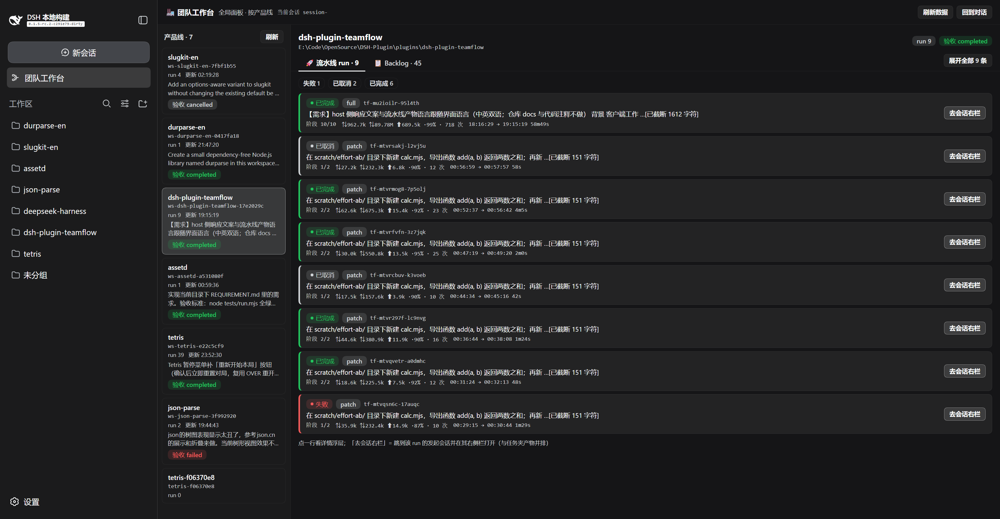
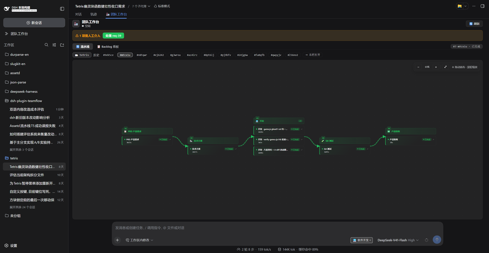
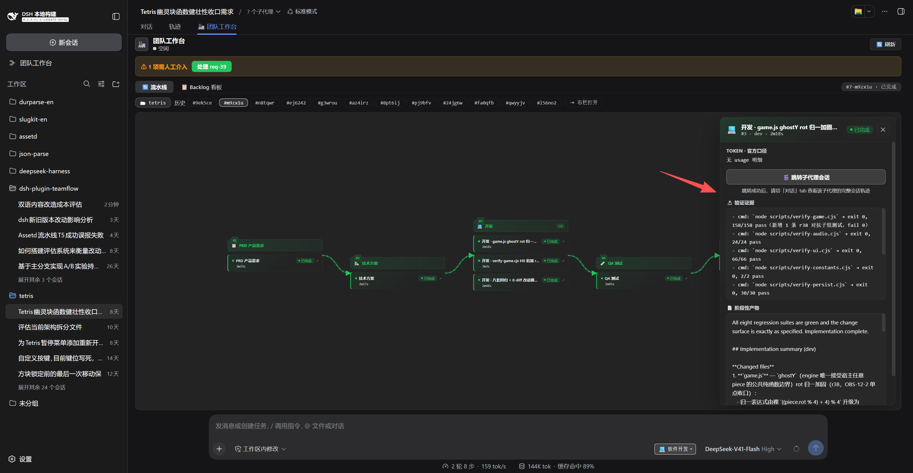
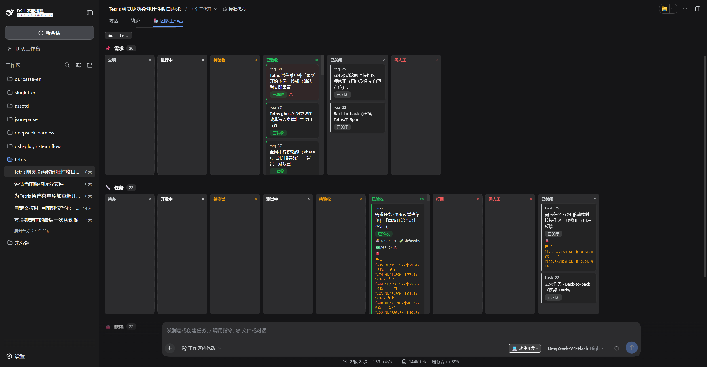
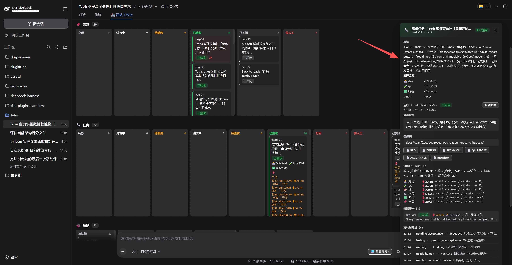
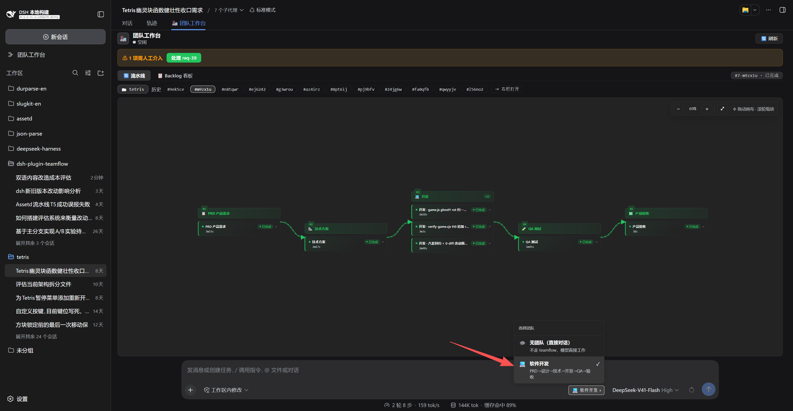

# dsh-plugin-teamflow

[](https://www.npmjs.com/package/dsh-plugin-teamflow) [](./LICENSE)

中文 | [English](./README.en.md)

TeamFlow 团队研发流水线 —— DeepSeek Harness 可分发插件（`dsh plugin --profile web add` 安装）。

把「用户一句话需求 → 真实研发团队多 Agent 流水线」做成宿主级能力：

```
需求 → PRD（基于既有模式/产品记忆，文档归档防臃肿）
     → （UI 改造时）UI/UX 设计
     → （新项目时）架构师规划并落地脚手架 + AGENTS.md
     → 高级全栈工程师技术方案（与派发任务对齐）
     → 可拆分任务时按并发并行开发
     → QA 功能测试（结构化缺陷 → 登记 Bug）
     → 产品验收（更新产品记忆）
```

## 界面预览

1. 全局面板——左侧边栏「🏭 团队工作台」图标（跨会话 / 产品线视角：产品线列表 + run 列表 + Backlog 标签页 + 覆盖式详情浮层）

   

2. 流水线视图——阶段蛇形泳道 + 节点卡片（状态/耗时/token/子代理会话）

   

3. 阶段详情抽屉——阶段性产物全文 + token 明细 +「🎬 跳转子代理会话」

   

4. Backlog 看板——需求/任务/缺陷拖拽泳道

   

5. 看板任务详情——任务卡抽屉（需求原文/分配/事件时间线/子卡/缺陷/token）

   

6. 团队选择——🏭 按钮 + 团队下拉

   

## 核心特性

- **一句话需求 → 可验收的交付**：从需求到 PRD / 技术方案 / 并行开发 / QA / 验收全链路自动编排，每个阶段有任务卡、有产物、有结论；机械小改动可用 `patch` / `lite` 档裁剪阶段集，不必为一行改动跑完整瀑布。
- **多 Agent 团队 + 并行开发**：按架构蓝图把需求拆成可并行任务（默认 3 路并发，上限 8），产品 / 架构 / 开发 / QA 各自独立上下文，互不污染。
- **防假交付**：交付看证据不看措辞——阶段必须给出「命令 + 退出码 + 断言数」的验证证据，QA 有独立对抗探针，验收只认显式结论行（缺失即停线转人工）。
- **QA 打回闭环**：P0–P2 缺陷自动打回修复 → 复验（≤2 轮），每条缺陷都带「检测命令 + 通过判据」；超限转人工，不会伪装成「已完成」。
- **断点续跑 + 完成汇报**：进程崩溃 / 重启后从第一个未完成阶段继续（已完成阶段复用产物）；流水线结束时自动把汇总（状态 / 阶段 / token / 后续指引）投递回发起会话。
- **你的仓库保持干净**：流水线文档收口在 `docs/teamflow/` 任务夹，插件自己的运行日志在 run 结束时归档出项目，收口提交只带**代码 + 任务夹**（一个 run 一个 commit，**不需要你预先配置 `.gitignore`**）。若历史提交里已经混进过 `logs/teamflow/`，在目标仓库执行 `git rm -r --cached logs/teamflow` 移出即可（本地文件保留）。
- **🏭 团队工作台（Web 双入口）**：会话内 tab（流水线图 + 拖拽看板 + 成本中心 + 人工介入中心）与应用级主面板（产品线视角，跨会话可用）；点开 run 看阶段、token、验证证据与产物。**界面中英双语**，跟随宿主语言实时切换；host 侧的回复、流水线日志与产物文档同样跟随语言（run 起跑时定一次，同一条 run 内一致）。
- **token 有账可查**：按官方口径记录每个阶段的输入（未命中 / 命中）/ 写缓存 / 输出与调用数，并给出缓存命中率，汇报与看板同口径；机械阶段自动降档推理强度，重试时回升。


## AGENTS.md 最小侵入原则（重要）

AGENTS.md 会被 harness 无条件注入每个会话，是**团队资产**。TeamFlow 遵循职责分离：

- **AGENTS.md 只放稳定共识层**：团队角色流程、工程约定、文档索引、`<!-- teamflow:begin/end -->` 托管区（仅指针）。
- **产品记忆/待办放独立活文档** `docs/teamflow/memory.md`（按需读取，不注入每次会话 → 省 token）。
- **已有项目接入**：检测到 AGENTS.md 已存在 → 绝不重写/重排/覆盖，仅在文末追加托管块（若没有）；团队原有约定一行不动。
- **退出干净**：团队停用 TeamFlow 后，删除托管块与 `docs/teamflow/` 即完全复原，AGENTS.md 无残留账本。

## 架构（阶段 3）

```
web profile 宿主组合
├── teamflow-host   (host/)     Cordis service `teamflow`
│     ├── ctx.typert.register(strict descriptors)   ← Remote 方法（descriptors.ts 纯数据，host / client 共用）
│     ├── ctx.tools.register(teamflow_*)            ← 模型工具
│     └── node:fs → $DSH_HOME/teamflow/…            ← backlog / journal / 归档日志
└── teamflow-client (client/)   ← package.json 声明 dsh.client，宿主组合自动扫描注册
      ├── conversation.view「🏭 团队工作台」（会话内 tab）
      ├── sidebar.panellist + main/teamflow（全局产品线面板）
      └── sidebarRightTabs「teamflow-run」（右栏 run 详情）
```

两条硬约束决定了这个形态（详见 `AGENTS.md` §3）：**不用 `@Remote` 装饰器**（插件以纯 JS 分发，Remote 走 `ctx.typert.register` 的严格描述符）；**必须是宿主级插件**（动态插件的 `fs` 被沙箱限制在运行时根，写不了 `$DSH_HOME`）。


## 目录结构

```
dsh-plugin-teamflow/
  package.json          # dsh.bundle.patch + dsh.client 声明；exports 指向 lib/ 构建产物
  cordis.patch.yml      # 插件挂载 patch（insert 块，entry 用包根）
  tsdown*.config.ts     # 构建：client → lib/client.js；host/store/descriptors → lib/*.mjs
  host/                 # TeamflowService + core/*（流水线 / backlog / runner / guard / triage / state…）
  client/               # Web 工作台（会话内 tab + 全局面板 + 右栏 run 详情）
  store.ts              # 持久化层（原子写 / 备份 / 损坏自愈 + journal 序列化）
  descriptors.ts        # Remote 描述符（纯数据，host / client 共用）
  test/                 # 无依赖测试（node test/*.js，14 套件）
  docs/                 # ADR / 开发日志 / 评测语料 / release notes
```

全仓 TS/TSX：**host 必须构建**（Node 的 type stripping 对 `node_modules` 下的文件不生效，而宿主从 profile 的 `node_modules` 加载插件），改源码后跑 `pnpm bundle` 重建并同步 profile 副本的 `lib/`。逐文件说明与开发环境见 `CONTRIBUTING.md`。


## 环境要求

- DeepSeek Harness（dsh）宿主，**web profile**（插件含浏览器端工作台，client 面向 web 平台）；
- Node.js ≥ 22.18；
- 依赖宿主提供的 `@deepseek-ai/dsh-*` 与 `react`（peerDependencies，宿主注入，无需单独安装）。

### 版本锚定（dsh 宿主兼容性）

基线 **dsh v0.2.0-rc.2**（预览版），**下限 v0.1.7-alpha.1**（v3 宿主的 `source.kind` 是封闭词表、不收 `plugin:*`，故不可回退到 0.1.5-rc.2）。

**`engines.dsh` 声明为并集区间** `">=0.1.7-alpha.1 <0.3.0 || >=0.2.0-rc.1 <0.3.0"`：预发布只匹配同 tuple 区间，**简单放宽上界会让 `0.2.0-rc.x` 判 fail**（semver 7.7.4 实测）。宿主**不校验**该字段，它只表达对正式版的兼容声明；判断发布线以 `next` 为准（`latest` 滞后）。

**0.2.0 逐项核对：未发现破坏**（tsc 对着已装的 0.2.0-rc.2 编译 0 错；实际 import 的 4 个宿主包导出 0 缺失；`inject` 语义、manifest schema、patch 的 `insert:` 均未变；新增的可选 `external` 本插件用不上）。⚠ 这是**静态**核对，运行时仍以重启实测为准。

可能受益：0.2.0 的 Windows ACL 修复（可重测「E: 盘 fresh 目录 grantWrite 必败 Win32 5」）；`user-questions` 的定时等待与迟到回复（澄清闸门需复验调用契约）。

升级 dsh 后若行为异常，先核对两处：① 注入的 session 事件必须用 producer-owned 的 `source.kind='plugin:dsh-plugin-teamflow'`（v3 的 `plugin` wrapper 已退役）；② 计量读宿主投影 key（`tokenUsage` / `sessionStats`），宿主改 key 时需同步 `host/core/metering.ts`。**历次兼容核对的逐项证据见 `CHANGELOG.md`**（v0.1.6 / v0.1.7 / 0.2.0 三次审计）与 `docs/TODO.md`。


## 安装（对使用者）

```bash
# 从 npm 安装（发布后）—— 装到 web profile
dsh plugin --profile web add dsh-plugin-teamflow

# 或本地目录安装（开发时）
dsh plugin --profile web add file:./plugins/dsh-plugin-teamflow
```

> ⚠️ **桌面版（dsh 0.2.0 起）要单独装一次**：它用独立的 `desktop` profile（`~/.dsh/profiles/desktop`），
> 与 `web` 各自一份 node_modules —— 只装在 `web` 上，桌面版里**看不到本插件**（不是插件坏了）。
> 且 CLI **明确拒绝** `--profile desktop`（`managed exclusively by the Electron application`）
> ⇒ **桌面版请用应用内的插件管理界面安装**。

安装后**重启** `dsh --profile web`（桌面版则重启桌面应用），宿主行 `teamflow-host` 生效：
- 模型侧出现 12 个 `teamflow_*` 工具：`start / triage / status / backlog / claim / update / assign / cancel / resume / pause / resume_session / merge`；
- 浏览器侧：会话头部「🏭 团队工作台」tab（会话内）+ **左侧边栏「团队工作台」图标**（全局面板，产品线视角）；
- backlog 写入 `$DSH_HOME/teamflow/<product>/backlog/*.json`。

> 注意：`@deepseek-ai/*` 为宿主私有包，运行需 DeepSeek Harness（dsh）宿主环境；本包不发布也无法独立运行。

## 快速上手

1. **选团队**：会话输入框旁点「🏭」按钮，选择团队（或选「无团队」= 不走流水线，直接对话）；
2. **发需求**：直接说需求，模型会自动调用 `teamflow_start`（自动分诊模式：patch / lite / tech / medium / full）——也可以用「直接跑 medium 模式做这个」等指定档位；
3. **看进展**：会话头部切到「🏭 团队工作台」tab——流水线图实时刷新（每阶段 token / 耗时 / 子代理会话），Backlog 看板可拖拽流转、点卡片看详情；点「⇥ 右栏打开」把该 run 详情放到右侧栏（与任务夹产物并排）。想看**跨会话/全局**的情况，点左侧边栏「团队工作台」图标（产品线视角：产品线 → run 列表 + backlog）；
4. **收结果**：流水线完成后自动向当前会话汇报（状态 / 阶段统计 / token / 后续指引）；中断/失败的运行可「↻ 从断点重跑」。

> 使用规则提醒：`teamflow_start` 调用后**主线程不要自行改代码或跑验证**——实现、QA、汇报由流水线各阶段子代理完成（避免与流水线抢活）。

## 卸载（对使用者）

```bash
dsh plugin --profile web remove dsh-plugin-teamflow
```

重启 `dsh --profile web` 后插件完全移除（模型侧 `teamflow_*` 工具与「🏭 团队工作台」tab 消失）。

可选清理（卸载**不会**自动清，按需执行）：
- **运行数据**：删除 `$DSH_HOME/teamflow/`（backlog / 运行记录，删除前确认不再需要）。
- **项目痕迹**：若某项目用过 TeamFlow，删除该项目 `AGENTS.md` 中的 `<!-- teamflow:begin/end -->` 托管块与 `docs/teamflow/` 目录，即可完全复原（AGENTS.md 最小侵入原则的"退出干净"）。

## 开发与验证

```bash
pnpm test               # smoke（描述符/结构/安全）+ journal（断点续跑行为）
pnpm run typecheck      # tsc --noEmit 类型检查（需本机 dsh profile 提供 @deepseek-ai/* 类型）
node --check lib/host.mjs lib/client.js lib/store.mjs lib/descriptors.mjs
pnpm run bundle         # 构建 client（tsdown → lib/client.js，__ModuleLoader__.load 注册）
```

**插件开发者**（本插件的本地开发链路）见仓库内 [`AGENTS.md`](./AGENTS.md) 与 [`docs/adr/`](./docs/adr)——含部署同步（`node deploy.mjs` → 重启 `dsh --profile web`）、生效前提（运行中 web 从 profile 部署副本加载 host，只构建源码不生效）、设计决策记录（ADR-0001~0010）与基准对比（`docs/benchmarks/`）。本仓库其余源码均为 TS/TSX，需先 `pnpm bundle` 构建后再运行（`node_modules` 下 strip-types 不生效）。

注意：`lib/` 被 `.gitignore` 排除，但发布必须带上构建产物（`files` 白名单已含 `lib/`；`exports["./client"]` 指向 `./lib/client.js`）。

## 契约速览

| 工具 / Remote | 作用 |
|---|---|
| `teamflow_start` / `teamflow.start(sessionId, requirement, options)` | 启动流水线 |
| `teamflow_status` / `teamflow.list()` + `teamflow.snapshot(runId)` | 查询运行进度（阶段/状态/token/日志/是否需人工） |
| `teamflow_backlog` / `teamflow.backlog(product)` | 查看 backlog（+ persistence 落盘路径） |
| `teamflow_claim` | 认领任务或缺陷 |
| `teamflow_update` / `teamflow.backlogUpdate(kind, id, to, product, reason)` | 人工流转状态（处理 needs-human） |
| `teamflow_cancel` / `teamflow.cancel(runId)` | 取消运行（工作台 / 全局面板 run 行 / run 详情三处按钮，两段式确认；仅对正在跑的 run 生效） |
| `teamflow_resume` / `teamflow.resume(runId, sessionId)` | 断点续跑（从第一个未完成阶段重跑） |
| `teamflow_triage` | 需求分诊预览（默认 start 自动分诊，仅在想预评估/强制 mode 时使用） |
| `teamflow_assign` | 指定任务/缺陷的负责人（与 claim 分离：claim 只改状态） |
| `teamflow_pause` / `teamflow_resume_session` | 当前会话暂停/恢复 teamflow 触发（会话级，新会话自动重置） |

## License

MIT —— 详见 [LICENSE](./LICENSE)。
